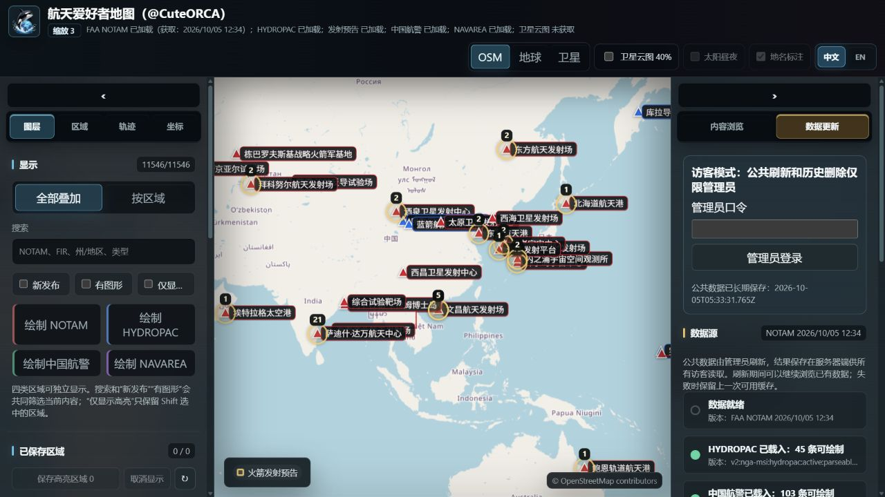

# 航天爱好者地图

把航空通告、海上航警、火箭发射预告和卫星轨道放在同一张地图上。你可以看二维地图，也可以切到三维地球；可以保存感兴趣的区域、导入自己的坐标、绘制轨迹和播放弹道演示。

**[打开完整地图](https://space-enthusiast-map.onrender.com/) · [GitHub 在线入口](https://cuteorca26.github.io/space-enthusiast-map/)**

在线使用不需要安装软件，也不需要注册本站账号。用电脑浏览器操作更方便。免费服务器休眠后，首次打开通常需要等约一分钟；启动后还可能需要加载已保存的数据。[Render 免费服务说明](https://render.com/docs/free)

> **普通访客可以查看、筛选、回放和使用个人工具。公共数据刷新与共享刷新历史删除，只对管理员开放。**



*界面示例。图中的时间、数据数量和地图位置仅供示意，实际结果以打开后的页面为准。*

**按需阅读：** [快速上手](#快速上手) · [航空和海上通告](#看航空和海上通告) · [卫星轨道](#看卫星轨道和覆盖范围) · [个人坐标和轨迹](#使用自己的坐标和轨迹) · [保存规则](#哪些内容会保存) · [管理员操作](#管理员怎样更新数据) · [常见问题](#遇到问题先看这里)

## 快速上手

第一次使用，可以先做这四步：

1. **打开地图。** 等地图和数据加载完成；首次唤醒服务器时，先留在页面等待。
2. **打开一个图层。** 在左侧“图层”中勾选需要绘制的数据，例如“中国航警”或“NOTAM”。
3. **读一条通告。** 在右侧“内容浏览”切换到同一数据源，点一条记录，查看原文和位置。也可以直接把鼠标移到地图上的区域。
4. **换一种视角。** 顶部点“地球”看三维位置关系，点“卫星”看卫星底图。这里的“卫星”是底图按钮；查看卫星轨道，要用右侧的“卫星轨道”栏目。

**勾选图层是在选择“我看什么”；公共刷新是在更新“大家能看到的数据”。** 看地图和切换图层不需要管理员登录，也不需要先刷新数据。

## 界面里的东西都在哪里

| 位置 | 主要用途 |
| --- | --- |
| 顶部 | 切换 OSM、三维地球、卫星底图、云图、昼夜效果、地名和中英文 |
| 左侧 → 图层 | 选择通告图层、搜索和筛选、保存区域、回放刷新历史 |
| 左侧 → 区域 | 显示国家、地区、海域、飞行情报区，以及发射场、着陆场和靶场 |
| 左侧 → 轨迹 | 手绘轨迹、调整线条、查看地表长度和倾角，设置弹道演示 |
| 左侧 → 坐标 | 添加坐标、写备注、导入或导出 KML / KMZ |
| 右侧 → 内容浏览 | 阅读通告、查看发射预告、选择卫星及其轨道和覆盖范围 |
| 右侧 → 数据更新 | 查看数据更新时间、选择云图时间；管理员在这里登录并刷新公共数据 |

常用地图操作：

| 操作 | 效果 |
| --- | --- |
| 鼠标左键拖动 | 移动地图；在地球模式下转动地球 |
| 滚轮 | 放大、缩小 |
| 在地球模式下，按住中键拖动，或按住 Shift 再左键拖动 | 调整观察角度 |
| 在地球模式下，鼠标右键拖动 | 拉近、拉远视角 |
| 鼠标移到通告区域 | 查看区域信息；重叠区域可在提示中切换阅读 |
| 单击通告区域 | 固定提示框，方便阅读原文；再次单击可取消固定 |
| 按住 Shift 单击区域 | 逐个添加或取消高亮，可同时选中多个区域 |
| 按住 Ctrl 单击通告区域 | 联动高亮同一时间窗口的其他通告，方便对照 |

如果单击地图变成了“加点”，先关闭“点击地图添加坐标”或轨迹绘制模式，再继续浏览。

## 看航空和海上通告

### 先选数据，再选范围

| 数据源 | 看什么 |
| --- | --- |
| NOTAM | 航空通告，例如临时空域限制、活动区域及相关时间、高度信息 |
| HYDROPAC | 太平洋及相关海域的海上航行警告 |
| 中国航警 | 中国海事局发布的航行警告 |
| NAVAREA | NAVAREA I–XXI 共 21 个海区的公开航行警告；覆盖情况以当次数据源返回结果为准 |

1. 在左侧“图层”打开需要绘制的来源，在右侧“内容浏览”选择对应来源。
2. 需要缩小范围时，使用搜索，或切换“按区域”。国家、海域和 FIR / ARTCC 边界可以在左侧“区域”中打开。FIR / ARTCC 是航空管理区域，适合按空域查看通告。
3. 点列表中的记录或地图上的区域，读原文、坐标和有效时间。部分通告也有高度范围。
4. 需要集中查看时，使用“新发布”“有图形”“仅显示高亮”等筛选；找不到记录时，也记得检查这些筛选是否仍开着。

Ctrl 联动只是在按时间找相关记录，不能据此认定它们属于同一次发射或同一个事件。

### 有通告，为什么地图上没有边界

**“有文字记录”和“能画成区域”是两回事。** 有些通告没有明确坐标，有些只提供参考点或不完整的边界。正文明确给出圆心和半径的圆形，以及明确给出方位角的扇形，可以绘制；Q 行检索半径不会当作实际限制区。软件会保留原文，未画出的 HYDROPAC / NAVAREA 通告也能按编号搜索，并显示未绘制原因。弧线拼接、多点走廊和缺少坐标的海岸线等复杂描述目前仍可能无法绘制，不会随意补成多边形。

抓取来源不等于掌握全世界的全部通告：FAA 的公开检索和海警镜像都有覆盖与时效限制。若分页获取失败，程序会提示失败并保留旧数据；NAVAREA 按海区保留失败海区的已有通告，其余海区可继续更新。请留意数据时间。NOTAM 的 D 项活动时段会附在时间说明中，须结合原文理解，不能把整个起止日期都视为连续活动。

通告列表和有效期筛选以保存数据时的刷新时间为依据。数据较旧时，列表中的“当前或未来”不一定仍对应今天，先看“数据更新”里的时间，再看原文的有效期。FAA 等来源也不能保证覆盖全球所有通告；软件读取到的内容以实际接入的数据源为准。

### 保存自己关心的区域

1. 按住 Shift 单击需要保留的区域，让它们高亮。
2. 在左侧“图层”的“已保存区域”中，点“保存高亮区域”。
3. 以后点保存列表中的条目即可重新查看；可用 Shift 组合查看多个条目。

保存的是当时的区域内容，包括坐标、原文及相关时间信息。它可以独立于当前筛选显示，因此适合留下观察记录；再次打开时仍要核对原通告的有效期。“取消显示”只是把它从当前画面移除，删除保存条目才会移除这份个人记录。

在线版把这些个人区域保存在**你当前浏览器**中，其他访客看不到，也不会自动同步到另一台电脑。

### 回放一次过去的刷新

左侧“图层”里的“刷新历史”，提供 NOTAM、HYDROPAC、中国航警、NAVAREA 和卫星轨道的历史刷新记录。选择一个时间点，可以查看那次刷新保存下来的内容。

这里记录的是本站实际完成并保存的刷新，不能任意查询某个过去日期的全部通告。发射预告和云图也不是通过这五个历史标签回放。访客可以查看共享历史；删除共享历史需要管理员登录。

## 看发射预告和发射场

在右侧“内容浏览 → 发射预告”查看计划发射。可以按火箭、国家、载荷或发射场搜索，按发射场筛选，也可以使用“最近7天”筛选。点卡片可结合地图查看发射场位置。

左侧“区域”可以控制发射场、着陆场、靶场和中文标签的显示，也可以打开“发射预告圆环”，让地图上的发射场与预告信息对应起来。隐藏相关场站时，其圆环也会一起隐藏。

发射日期和时间可能调整；本站显示的是最近一次公共刷新保存的预告，临近发射时请同时核对原始来源。

## 看卫星轨道和覆盖范围

### 先选少量卫星，再播放

1. 在右侧“内容浏览 → 卫星轨道”搜索卫星名称、NORAD 编号、国际编号、国家、用途或系列。
2. 选择卫星，打开“显示轨道层”；按需要打开轨道线和名称。
3. 用“查看全轨道”查看轨道的整体形状，再到“时间与参考系”播放、暂停或倒放。

软件默认提供少量代表卫星，便于先熟悉操作。需要批量显示时，再选择范围和对象类型，点“载入”；也可以用“加入搜索结果”添加找到的对象。星座按钮支持按住 Shift 或 Ctrl 添加、移除一组对象。

搜索面向完整目录；批量载入会受到所选范围和类型影响。LEO、MEO、GEO、HEO 分别表示低轨、中轨、地球同步轨道和高椭圆轨道。目录中还可能包含退役载荷、火箭体、碎片和类型不明的对象。

一次显示很多轨道、全部名称和覆盖范围，会明显增加浏览器负担。先选少量对象，确认操作顺畅后再增加。“清空选择”清除的是你的当前显示选择，不会删除服务器上的公共卫星目录。

### 改时间、换视角

| 控件 | 用途 |
| --- | --- |
| 正放、暂停、倒放及倍速 | 观察卫星随时间移动，或停在某个时刻 |
| 前后跳转、现在 | 跳到邻近时刻，或回到当前时间 |
| 日历指定时刻（北京时间） | 把画面调整到指定日期和时间 |
| 北京时间 / UTC | 切换时间的显示方式 |
| 地球固定 / 轨道固定 | 分别观察卫星相对地面的运动，或更清楚地看轨道空间形状 |

轨道位置由轨道数据计算得到，并非卫星实时定位。**把日历改到过去，不等于已经取得那天的轨道数据。** 使用当前数据推算很久以前或以后的时刻，误差可能增大。

如果需要按历史轨道数据查看，选择卫星和目标时刻，在历史根数数据源处填写自己的 Space-Track 账号，点“加载该时刻根数”。“根数”就是用于计算轨道的一组参数。这项查询会经本站后台向 Space-Track 发起；账号密码不进入本站的公开备份。未来时刻只能推算，不能取得尚未产生的真实历史数据。

### 看遥感成像范围和通信覆盖

打开“覆盖总开关”，再按需要打开“成像幅宽”或“通信范围”。成像幅宽表示模型计算出的地面覆盖带；通信范围表示按相应参数计算出的几何覆盖范围。

遥感侧摆有两种查看方式：

| 方式 | 适合观察什么 |
| --- | --- |
| 固定地面区域 | 固定地面目标，查看卫星运动时所需的侧摆变化 |
| 固定侧摆角 | 固定侧摆角，查看覆盖带如何随卫星移动 |

侧摆角可在 ±45° 内以 0.1° 调整，也可以用“拖动幅宽”操作，或“恢复天底”回到朝正下方观察。资料明确的卫星使用对应参数；缺少资料时，界面会标出估计信息。

这些图形适合比较位置和覆盖关系，不代表卫星此刻真的在拍摄，也不保证某处实际有通信服务。

### 导入自己的轨道数据

展开“自定义轨道数据”，粘贴内容后点“加入并绘制”，或用“读取文件”导入。支持 TLE / 2LE / 3LE、GP JSON / CSV，以及 OMM KVN / XML。

导入的自定义轨道保存在当前浏览器中，不会添加到公共卫星目录。“全部清除”用于移除这些自定义轨道。

## 看卫星云图

1. 顶部选择“地球”或“卫星”视角，打开“卫星云图”。
2. 在右侧“数据更新”的云图控件中选时间，或拖动时间条查看不同节点。
3. 按需要调整透明度，让云层与地面信息叠加显示。

云图来自 NOAA 的小时数据，通常提供最近约 48 小时的节点。在线版展示的是管理员最近一次刷新保存下来的时间列表；如果数据已经较旧，“最新”表示列表中的最新节点，不一定是此刻。访客可以选择已发布的节点，公共“刷新最新”由管理员执行。首次加载某个节点时，下载和处理云图可能需要等待。

“太阳昼夜”用于在地球模式下查看光照和昼夜分界，和云图是两个独立的显示开关。光照使用当前时间，或你设置的卫星、弹道演示时间；选择云图时间不会自动改变光照时间。

## 使用自己的坐标和轨迹

### 添加坐标、导入 KML / KMZ

在左侧“坐标”中输入名称和位置，点“添加点”；也可以打开“点击地图添加坐标”，直接在地图上点选。选中已有条目后，可以修改名称、位置和备注，点“保存修改”。

坐标按**纬度在前、经度在后**填写，支持十进制度和度分秒。例如：

```text
39.014375, 102.007433
39°0'51.75"北, 102°0'26.76"东
```

批量导入时，每行一个位置，可以按“名称, 纬度, 经度”填写：

```text
观察点A, 39.014375, 102.007433
观察点B, 40.000000, 103.000000
```

KML / KMZ 文件可以导入点、线和面。用“定位自定义”找到内容，再用“导出KML”或“导出KMZ”备份自定义坐标图层。**这两个导出按钮不会把手绘轨迹和整套弹道设置一起导出。**

自定义内容保存在当前浏览器中。换设备前先导出，清理浏览器的网站数据前也先备份。

### 手绘一条地面轨迹

1. 在左侧“轨迹”打开轨迹绘制总开关和“显示星下点轨迹线”。
2. 在地图上添加轨迹点；也可以打开“点击NOTAM/HYDROPAC区域作为轨迹点”，从通告区域取点。
3. 拖动点或曲线调整形状，使用“撤回”“重做”修正操作。
4. 调整颜色、线宽、虚线和发光效果，按需要显示地表长度、倾角。
5. 需要再画一条时，先“固定当前星下点线”，再“新建星下点线”。

这里的“星下点线”是地面投影参考线；手绘的线并不自动成为真实飞行记录。打开“当前轨迹使用椭球最短测地线”，可以改为按起终点间的最短测地线绘制和计长；未打开时，长度沿当前绘制的曲线计算。

### 多级分离、无动力飞行和再入演示

轨迹面板中的“级段弹道传播”用于设置分离后的运动演示：

1. 打开“绘制分离后的无动力弹道”；需要三维主动段时，再打开对应的主动段显示选项。
2. 设置主动段的地表起点，使用“添加分离级”增加对象。
3. 设置各对象的分离点和初始条件，可以从地图或主动段上选点。分离点与地表起点是不同的位置。
4. 查看计算结果，在地球模式下观察三维曲线；需要顺畅回放时，先完成“预计算缓存”。
5. 用各对象的分离时间偏移对齐演示，观察地面位置、高度和速度等结果。

支持最多 10 个对象，也有最大地面射程搜索和落点反算工具。这里的主动段主要根据所设位置构造，分离后的传播使用简化动力学模型；反算也可能有多个符合条件的结果。它适合学习和演示，不能仅凭一条曲线认定真实任务的飞行过程。

**手绘轨迹和弹道设置目前只保留在当前页面中。刷新或关闭页面后，不会自动恢复。**

## 哪些内容会保存

下面是**在线版**的保存规则。它们最容易混淆，也决定了换设备或刷新页面后还能看到什么。

| 内容 | 保存在哪里 | 其他访客会受影响吗 |
| --- | --- | --- |
| 公共通告、发射预告、卫星目录和云图时间列表 | 服务器缓存；长期保存成功后备份到 GitHub Release，重启后恢复 | 大家读取同一份；管理员刷新后大家可以读取新数据 |
| 五类数据源的刷新历史 | 服务器及长期备份 | 大家可回放；管理员删除会影响大家 |
| “已保存区域”中的个人条目 | 当前浏览器的本地存储 | 只属于这个浏览器 |
| 自定义坐标、导入的 KML / KMZ 和自定义轨道数据 | 当前浏览器的本地存储 | 不会改动公共数据 |
| 手绘轨迹、弹道设置和预计算结果 | 当前页面的内存 | 只影响当前页面；刷新或关闭后不自动保留 |

浏览器保存不等于账号云同步。尽量用同一浏览器、同一访问入口；换浏览器、换设备或清理网站数据后，个人内容可能找不到。需要保留自定义坐标时，请主动导出文件。

公共长期备份是公开的，任何人都能从 GitHub 下载。备份只包含允许发布的公共数据，不包含个人保存区域、账号密码、Space-Track 历史查询缓存、日志或服务器环境变量。

多人打开时，各自移动地图、筛选内容、选择卫星和使用个人工具，通常互不影响。但大家共用一台免费后台服务器；多人同时加载大数据或进行后台计算，可能让响应变慢或排队。

## 管理员怎样更新数据

### 登录、刷新、检查保存结果

1. 打开右侧“数据更新”，输入本站独立的管理员口令并登录。它不是 GitHub 密码，也不是 GitHub Token。
2. 点需要更新的来源：NOTAM、HYDROPAC、中国航警、NAVAREA、发射预告或卫星轨道；云图使用“刷新最新”。
3. 等待页面显示进度和结果，不要连续重复点击。首次全量扫描可能很久，尤其是中国航警。
4. **核对数据更新时间，再核对长期保存状态。** 只有显示长期保存成功，新数据才算已经写入可恢复的备份。

刷新失败时，先看提示和原数据的时间；不要把“已开始刷新”当成完成。公共刷新成功，也不等于备份一定成功：例如 GitHub Token 到期时，新数据可能只在当前服务器缓存中。

管理员登录有效期为 8 小时，只保留在当前浏览器页签中。退出、关闭页签或服务器重启后，需要重新登录。维护长期备份所用的 GitHub Token，在 Render 的服务器设置中管理；具体步骤见[部署与维护说明](docs/DEPLOYMENT.md#管理员口令与备份令牌)。

### 删除共享刷新历史

登录管理员后，在左侧“刷新历史”切换到相应来源，找到要删除的记录，使用删除操作并确认。

这是共享记录：删除后，其他访客也不能再回放这条历史。删除不会自动重新抓取数据；操作完成后，也要确认长期保存状态，让备份中的历史同步更新。

删除自己浏览器里的保存区域、坐标或自定义轨道，不需要管理员权限。

## 遇到问题先看这里

### 打开很慢，或者暂时没有地图

先等免费服务器唤醒，通常约一分钟。如果 GitHub 入口加载不出来，试试[直接打开完整地图](https://space-enthusiast-map.onrender.com/)。服务器额度耗尽、服务异常或外部底图连接失败，也可能影响显示；这些情况需要管理员查看服务状态。

### 列表里有数据，地图上却没有区域

检查左侧是否勾选对应的绘制图层，是否开启了“仅显示高亮”等筛选，以及该条通告是否有可绘制边界。文字记录不一定能画成区域。

### 刷新按钮不能用

访客不能刷新公共数据，也不能删除共享刷新历史。管理员先在“数据更新”登录；口令未配置、登录已过期或服务器刚重启时，也需要重新检查登录状态。

### 数据时间较旧，或者改日期后卫星位置不准确

通告、发射预告和云图时间列表依赖管理员刷新。卫星则要同时看显示时间和轨道数据的时间；改日历不会自动取得对应日期的历史根数。

### 画面卡顿

先减少选中的卫星，关闭“全部名称”和不需要的覆盖范围，再减少叠加图层。浏览器的硬件加速也会影响三维显示；免费后台计算繁忙时，需要等待。

### 之前保存的个人内容不见了

确认使用的是原来的浏览器和访问入口，并检查是否清理过网站数据。自定义坐标可以从之前导出的 KML / KMZ 恢复；手绘轨迹和弹道设置目前没有刷新后自动恢复功能。

### 页面提示长期保存失败

管理员检查 GitHub Token 是否到期或被撤销、所选仓库和权限是否正确，以及 GitHub 接口是否暂时不可用。已有完整备份会保留，但尚未保存的新数据不能保证在服务器重启后恢复。见[长期备份异常处理](docs/DEPLOYMENT.md#长期备份异常)。

## 本地运行与自行部署

- 想在自己的电脑上使用：看[本地运行说明](LOCAL_GUIDE.md)。
- 想部署自己的站点，或维护当前站点：看[部署与维护说明](docs/DEPLOYMENT.md)，包括免费额度、管理员口令、备份令牌和更新步骤。

当前公开站点采用 Render 免费实例，GitHub 保存代码、在线入口和公共备份。访客使用不收费；免费托管有休眠、内存、运行时长和流量等限制，不能理解成无限资源。平台规则可能调整，维护者应以[Render 官方说明](https://render.com/docs/free)为准。

地图和计算结果用于学习、整理公开资料和可视化。涉及真实活动时，请核对原始公告及其有效期；不要把模拟结果作为飞行、航行或其他实际任务的决策依据。

原作者署名：`@CuteORCA`。保留原作者署名；原发布包未明确提供独立许可证，本仓库不自行补加许可。

本说明按当前在线版功能整理，更新于 **2026-10-05**。
